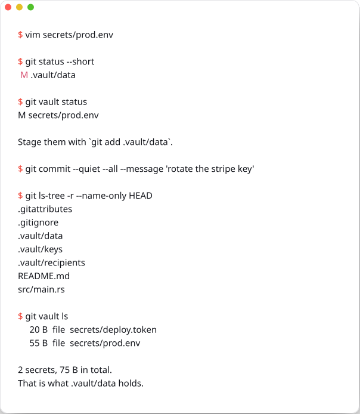

<div align="center">


# git-vault

**Secrets in git, sealed into one file.**

[](https://github.com/roman-16/git-vault/releases/latest) [](https://github.com/roman-16/git-vault/releases) [](docs/installation.md) [](LICENSE)

<picture>
  <source media="(prefers-color-scheme: dark)" srcset="assets/demo-dark.svg">
  
</picture>

</div>
<br />

Locally your secrets are ordinary files and git behaves normally. In the repository they exist only as one encrypted file that reveals nothing without a key: not the contents, and not the names, paths or directory structure either.

- **Names and structure stay hidden.** Every other transparent-encryption tool for git encrypts file by file, so `secrets/stripe-production.key` stays visible to anyone who can see the repository. Here the remote sees `.vault/data` and nothing else. → [Why nothing else does this](docs/comparison.md)
- **Plain git, all of it.** `status`, `add`, `commit`, `checkout`, `merge`, `rebase`, `revert`, `stash`, `cherry-pick`, worktrees. No wrapper commands, no aliases, and commit hashes match what you see locally.
- **Harmless without the key.** A clone with no key holds the sealed file, and commits, merges and pushes leave it byte for byte identical. Nothing to configure, nothing to break.

## Install

| Method | Command |
| --- | --- |
| **Linux, macOS** | `curl -fsSL https://raw.githubusercontent.com/roman-16/git-vault/main/scripts/install.sh \| sh` |
| **Windows** | `irm https://raw.githubusercontent.com/roman-16/git-vault/main/scripts/install.ps1 \| iex` |
| **Homebrew** | `brew install --cask roman-16/tap/git-vault` |
| **winget** | `winget install Roman-16.GitVault` |
| **Arch (AUR)** | `yay -S git-vault-bin` |
| **Nix** | `pkgs.git-vault` |
| **cargo** | `cargo install git-vault-cli` |

There is also an APT repository for Debian and Ubuntu, `.rpm` and `.apk` packages, and plain binaries with checksums for Linux and macOS on x86-64 and arm64, and Windows on x86-64. See [Installation](docs/installation.md).

Nothing is published until the first release is tagged.

Already installed? `git vault update`.

## Get started

```console
$ git vault init
Vault created.
  identity   /home/you/.config/git-vault/identity
  recipient  age1x8x3zw8ul3zjw5xn0dxlh0q6nx85t5uvjduleu9dgepgq94n50j

$ git vault add secrets/
Sealing secrets/

$ git add .gitattributes .gitignore .vault && git commit -m 'add a vault'
```

That is the whole setup. From here on, edit the files under `secrets/` like any others and commit with plain git.

On another machine, `git clone` then `git vault unlock`. If you have no access yet, `unlock` prints your public key and the one command somebody with access has to run. → [Getting started](docs/getting-started.md)

## What the remote sees

```
my-project/
  .gitattributes
  .gitignore
  .vault/data          binary, unreadable
  .vault/keys          the vault key, wrapped for each person
  .vault/recipients    who those people are
  README.md
  src/main.rs
```

No `secrets/` directory. Not the names of the files in it, not how many there are, not their contents. Everything else about the repository stays browsable, searchable and reviewable, with working pull requests, CI, blame and signed commits.

## What you can do

```bash
git vault init                    # generate a key, wire this clone, create the vault
git vault add secrets/ *.key      # declare what is secret
git vault status                  # which secrets changed
git vault diff [<path>]           # plaintext diff
git vault log [<path>]            # the history of one secret
git vault restore [<path>]        # discard local edits to secrets
git vault ls                      # what is sealed
```

```bash
git vault share alice.pub --label alice@work   # give somebody access
git vault keys                                 # who has access
git vault revoke alice@work                    # take it away, and rotate the key
git vault rotate                               # new key, everybody keeps access
git vault export-key ci.key                    # for CI
```

```bash
git vault unlock                  # secrets become ordinary files here
git vault lock                    # remove the plaintext and the local key
git vault unseal --into <dir>     # open a vault with no repository and no git
git vault doctor                  # check this clone, non-zero exit on problems
```

## Diffs and merges, in plaintext

`git diff`, `git log -p` and `git show` render the vault as text, so a change to a secret reads like a change to a file:

```diff
@@ -1,4 +1,7 @@
+# secrets/ci.env (file, 10 bytes)
+TOKEN=abc
+
 # secrets/prod.env (file, 43 bytes)
-STRIPE_KEY=sk_live_1
+STRIPE_KEY=sk_live_2
```

Merges work per secret. Two people editing different secrets, or different lines of the same secret, merge cleanly. When they edit the same line, the conflict markers land **inside the plaintext file**, so you resolve it by editing an ordinary file and then running `git vault seal`. Somebody without the key can still merge and rebase: entries are independent, so anything touched on one side only resolves without opening anything. → [Git integration](docs/git-integration.md)

## In CI

```bash
git vault unlock --key-file "$VAULT_KEY_FILE"
git vault doctor
```

`doctor` exits non-zero when a sealed path is tracked in plaintext, when the wiring is wrong, or when the vault does not match its key. It belongs in every pipeline that touches this repository. → [Scripting and CI](docs/keys-and-access.md#ci)

## Encryption you can verify

One key seals everything, using XChaCha20-Poly1305 with a nonce derived from the contents, so the same secrets always produce the same bytes. That determinism is what lets git store the vault as an ordinary file and delta it normally.

That key is wrapped for each person with [age](https://age-encryption.org), using either a native `age1…` key or an existing `ssh-ed25519` or `ssh-rsa` public key. `.vault/keys` is a stock age file, so anybody with their own key and the `age` CLI can recover the vault key by hand, without this tool.

**What still leaks:** that a vault exists, its rough size, which commits touched it, how many people have access and who they are, how many secrets there are, and each one's size to within a factor of two. Because sealing is deterministic, somebody watching the repository can also tell which entry changed in a given commit, and whether a secret went back to an earlier value. → [Threat model](docs/threat-model.md)

## Documentation

| Page | What's in it |
| --- | --- |
| [Installation](docs/installation.md) | Every platform, updating, uninstalling |
| [Getting started](docs/getting-started.md) | First vault, second machine, day to day |
| [Declaring secrets](docs/declaring-secrets.md) | Patterns, the two declaration files, why anchored patterns are faster |
| [Keys and access](docs/keys-and-access.md) | Recipients, sharing, revoking, rotating, CI |
| [Deploying secrets](docs/deploying.md) | Opening a vault with no repository: CI, servers, NixOS |
| [Git integration](docs/git-integration.md) | What every git command does, and which safety nets are git's own |
| [How it works](docs/how-it-works.md) | The three moments git gives us, and why it is built this way |
| [The `.vault` format](docs/format.md) | The sealed layout, byte for byte |
| [Threat model](docs/threat-model.md) | What is hidden, what leaks, what revocation cannot undo |
| [Troubleshooting](docs/troubleshooting.md) | Every `doctor` finding, and every refusal, with its fix |
| [Limitations](docs/limitations.md) | What this does not do |
| [Comparison](docs/comparison.md) | git-crypt, sops, transcrypt, encrypted remotes |

## Good to know

- **All secret changes commit together.** They live in one file, so `git add secrets/one.env` is not a thing. `git commit -a` takes every secret change at once.
- **`git clean -xdf` removes your secrets**, because they are ignored files. Committed ones come back with `git vault restore`; uncommitted edits are gone, exactly as they would be for any ignored file. git-vault refuses to seal a worktree where every secret has vanished, so at least the loss cannot be committed by accident.
- **Sealing something today does not unsay what was pushed yesterday.** `git vault add` says so when it untracks a file that git already has, and revoking access cannot retract what somebody already read.
- **`core.fsmonitor` is how `git status` notices a secret edit.** If something else already uses it, git-vault leaves it alone and says so; commits stay correct either way, through the pre-commit hook.

## Contributing

Bug reports, ideas and pull requests are all welcome. [`CONTRIBUTING.md`](CONTRIBUTING.md) covers the setup, and [`SECURITY.md`](SECURITY.md) has the private channel for security issues.

## License

[MIT](LICENSE)
